# Hướng Dẫn Dựng Chuyển Cảnh Mượt Mà Phong Cách "Google Gemini"

Video giới thiệu Gemini của Google nổi tiếng với phong cách **dòng chảy liên tục (continuous flow)**: các vật thể biến hình (morphing) mượt mà từ dạng này sang dạng khác (từ nét vẽ vector thành mô hình 3D, từ mô hình 3D xuyên vào thế giới thực) mà không có cảm giác bị ngắt quãng bởi các cú cắt cảnh (hard cuts).

Dưới đây là phân tích chi tiết kỹ thuật và hướng dẫn cách bạn có thể thực hiện hiệu ứng chuyển cảnh này cho video giới thiệu con lắc ngược quay của mình.

---

## 1. Phân Tích Kỹ Thuật Chuyển Cảnh Gemini

Phong cách này được xây dựng trên 3 trụ cột kỹ thuật chính:

### A. Match Cut & Morphing (Cắt khớp & Biến hình)
*   **Nguyên lý**: Vật thể ở khung hình trước và khung hình sau có sự tương đồng lớn về hình dáng, kích thước hoặc vị trí trong không gian (Composition). Khi chuyển cảnh, vật thể A sẽ tự động co giãn/biến đổi các đường nét để trở thành vật thể B.
*   **Ứng dụng cho con lắc**:
    *   *Nét vẽ phác thảo (CAD)* $\rightarrow$ *Mô hình in 3D nhựa* $\rightarrow$ *Con lắc thực tế*. Cả 3 cảnh này đều giữ nguyên góc quay camera (ví dụ góc nghiêng $45^{\circ}$) để người xem thấy con lắc chuyển đổi chất liệu một cách kỳ diệu tại chỗ.

### B. Z-Space Seamless Zoom (Phóng to xuyên không gian)
*   **Nguyên lý**: Camera ảo liên tục di chuyển tiến lên phía trước (Zoom-in), đâm xuyên qua một chi tiết của vật thể này để mở ra không gian của vật thể tiếp theo.
*   **Ứng dụng cho con lắc**:
    *   Camera phóng to cận cảnh vào vòng tròn đen của vòng bi 608 $\rightarrow$ Vòng tròn đen này mở rộng ra toàn màn hình và biến thành lỗ tròn của cổng jack nguồn DC 12V trên bo mạch $\rightarrow$ Camera lùi ra để lộ toàn bộ mạch điện tử.

### C. Motion Blur & Easy Ease (Độ mờ chuyển động & Nhịp điệu phi tuyến)
*   **Nguyên lý**: Các chuyển động không đều đều mà tuân theo đồ thị hình sin (nhanh ở giữa cú chuyển và chậm lại khi bắt đầu/kết thúc - Ease In/Out), kết hợp với hiệu ứng làm mờ do chuyển động nhanh (Motion Blur) để che giấu các điểm nối ghép giữa 2 cảnh.

---

## 2. Hướng Dẫn Thực Hiện Trên Các Công Cụ Dựng

### Cách 1: Sử dụng Adobe After Effects (Chuyên nghiệp & Chuẩn nhất)
Đây là công cụ mà các designer của Google sử dụng để dựng video gốc.

1.  **Sử dụng Camera 3D và Null Object (Seamless Zoom)**:
    *   Chuyển tất cả các phân cảnh (CAD arm, 3D print arm, real arm) thành Layer 3D.
    *   Sắp xếp chúng xếp chồng theo trục Z (chiều sâu).
    *   Tạo một `Camera` và một `Null Object` làm cha (parent) của Camera.
    *   Đặt Keyframe cho tọa độ Z của Null Object để Camera lao thẳng từ trước ra sau. Khi Camera đi qua ảnh của cảnh 1, nó sẽ đâm thẳng vào cảnh 2.
2.  **Sử dụng Shape Morphing (Biến hình đường nét vector)**:
    *   Vẽ cánh tay con lắc dưới dạng `Shape Layer` (đường Path).
    *   Tạo Keyframe cho thuộc tính `Path` ở giây thứ 1 (Cánh tay CAD).
    *   Copy Path của cánh tay thực tế ở giây thứ 2 đè lên. After Effects sẽ tự động tính toán các điểm neo để biến hình mượt mà từ CAD sang thực tế.
    *   *Mẹo*: Sử dụng plugin **Super Morphings** để AE tự động xử lý các hình vẽ phức tạp.

### Cách 2: Sử dụng AI Video Generator (Nhanh & Ít tốn công)
Nếu bạn không giỏi After Effects, bạn có thể dùng AI sinh video (như **Runway Gen-3 Alpha** hoặc **Luma Dream Machine**) bằng tính năng **Image-to-Video**:

*   **Bước 1**: Tạo một ảnh tĩnh A (ví dụ: Mô hình cơ khí 3D con lắc) và ảnh tĩnh B (Con lắc thực tế lắp ráp xong) có cùng góc chụp.
*   **Bước 2**: Tải ảnh A lên AI và nhập Prompt điều khiển chuyển cảnh:
    > `"A seamless, continuous fluid camera zoom-in transition. The 3D CAD mechanical model smoothly morphs and transforms into a real physical hardware device on a clean desk. Sleek high-tech corporate lighting, vector lines dissolving into real materials. Motion blur, 4k."`
*   **Bước 3**: AI sẽ tự động tạo ra đoạn clip biến đổi mượt mà giữa hai trạng thái mà bạn không cần phải vẽ keyframe.

### Cách 3: Sử dụng CapCut / Premiere Pro (Dành cho Editor phổ thông)
*   **Bước 1**: Đặt hai clip (ví dụ: clip quay camera mô phỏng MuJoCo và clip quay con lắc thực tế) đè lên nhau. Cố gắng căn chỉnh để góc nghiêng và vị trí của con lắc trong hai clip trùng khớp nhau nhiều nhất có thể (Match Cut).
*   **Bước 2**: Sử dụng chuyển cảnh **"Phóng to" (Zoom-in)** hoặc **"Biến dạng" (Distort/Warp)** có sẵn.
*   **Bước 3**: Bật tính năng **Motion Blur** trong cài đặt chuyển cảnh và kéo thời gian chuyển cảnh thật ngắn (khoảng 0.3 - 0.5 giây) để tạo cảm giác chuyển cảnh lướt cực nhanh và mượt.

---

## 3. Kịch Bản Áp Dụng Chuyển Cảnh Gemini Vào Video Con Lắc

Dưới đây là cách chúng ta kết nối các cảnh từ mục II trước đó thành một "dòng chảy" không vết cắt:

```mermaid
graph LR
    C1[Bản vẽ nét mảnh CAD]
    -->|Nét vẽ tự dày lên & hiện khối màu| C2[Mô hình 3D nhựa PLA]
    -->|Camera đâm xuyên qua lỗ ốc vít| C3[Mạch điện PCB lỗ]
    -->|Zoom out nhanh từ cảm biến AS5600| C4[Con lắc thật trên bàn]
    
    style C1 fill:#f9f9f9,stroke:#333,stroke-width:2px
    style C2 fill:#e1f5fe,stroke:#0288d1,stroke-width:2px
    style C3 fill:#e8f5e9,stroke:#388e3c,stroke-width:2px
    style C4 fill:#fff3e0,stroke:#f57c00,stroke-width:2px
```

1.  **Từ CAD sang In 3D (Morphing)**: Video bắt đầu bằng các nét vẽ vector màu trắng trên nền tối vẽ nên cánh tay. Đột nhiên, các nét vẽ biến thành khối nhựa màu xanh dương nhạt (in 3D), camera xoay nhẹ một góc $45^{\circ}$.
2.  **Từ In 3D sang Bo mạch (Zoom-in)**: Camera lao nhanh vào trục động cơ bước (lỗ tròn). Lỗ tròn này tối dần trong tích tắc và phóng to ra, mở ra cảnh tiếp theo chính là vòng tròn kim loại của jack cắm DC trên bo mạch điện tử, camera lùi dần ra để lộ mạch Arduino Nano đang nháy đèn LED đỏ.
3.  **Từ Bo mạch sang Con lắc thực tế (Match Cut)**: Camera di chuyển từ bo mạch, lia nhanh qua sợi dây nối lên cảm biến AS5600. Ngay khi cảm biến AS5600 lấp đầy khung hình, nó lập tức biến thành cảm biến thật trên thiết bị hoàn chỉnh, camera lùi ra (Zoom-out) để lộ toàn bộ bộ khung con lắc thực tế đang tự cân bằng.
