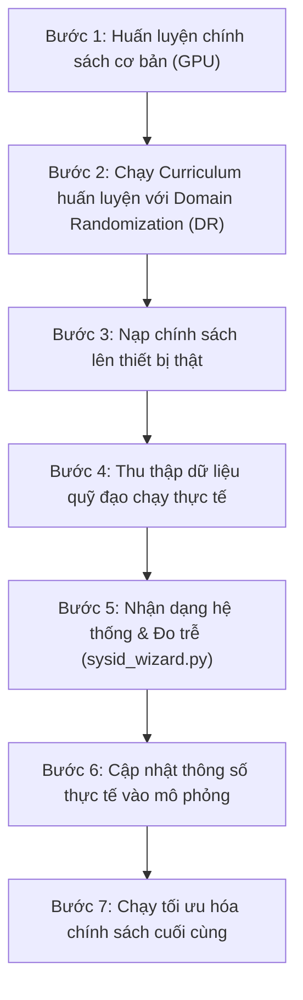

# Báo Cáo Huấn Luyện Soft Actor-Critic (SAC) Tăng Tốc Bằng GPU

Báo cáo này tổng hợp quá trình huấn luyện học tăng cường (RL) cho hệ thống Con lắc ngược quay (Rotary Inverted Pendulum) sử dụng tăng tốc đồ họa (GPU/CUDA), các lỗi đã sửa và chiến lược triển khai từ mô phỏng ra thực tế (Sim-to-Real).

---

## 1. Cấu Hình Môi Trường & Phần Cứng

- **Môi trường Conda**: `rotary-inverted-pendulum`
- **Đường dẫn Python**: `C:\Users\Admin\miniconda3\envs\rotary-inverted-pendulum\python.exe`
- **Phần cứng GPU**: NVIDIA GeForce RTX 4050 Laptop GPU (6GB VRAM, Driver bản 610.62)
- **Nhận diện thiết bị**: PyTorch nhận diện thành công card đồ họa và kích hoạt CUDA (`Using cuda device`).
- **Giám sát**: Sử dụng lệnh `nvidia-smi` xác nhận tiến trình Python đang chạy ở chế độ tính toán (`C`) trên GPU.

---

## 2. Các Lỗi Đặc Thù Trên Windows Đã Được Khắc Phục

Trước khi có thể chạy huấn luyện trên hệ điều hành Windows, hai lỗi nghiêm trọng gây sập chương trình trong file `train_sac.py` đã được giải quyết:

### A. Lỗi Sập Terminal Do Ký Tự Unicode
- **Nguyên nhân**: Terminal mặc định của Windows (Command Prompt/PowerShell chạy code page CP1252) không hỗ trợ hiển thị các ký tự toán học Unicode trong mô tả tham số của thư viện `argparse`, dẫn đến sập chương trình khi in trợ giúp.
- **Khắc phục**: Chuyển đổi toàn bộ các ký tự Unicode phức tạp sang định dạng ASCII an toàn (ví dụ: `∈` $\rightarrow$ `in`, `²` $\rightarrow$ `^2`, `≈` $\rightarrow$ `approx`, `→` $\rightarrow$ `->`).

### B. Lỗi Định Dạng `%o` Trong Thư Viện Argparse
- **Nguyên nhân**: Python 3.12+ gặp lỗi `TypeError: %o format: an integer is required, not dict` do ký tự phần trăm `%` xuất hiện trong chuỗi mô tả trợ giúp mà không được thoát chuỗi (escape).
- **Khắc phục**: Thoát ký tự `%` thành `%%` để tránh lỗi biên dịch chuỗi định dạng của Python.

---

## 3. Quá Trình Huấn Luyện & Chỉ Số Hiệu Năng

Tiến trình huấn luyện được kích hoạt bằng lệnh:
```bash
python src/rl/train_sac.py --device cuda --progress-bar
```

### Các chỉ số hiệu năng chính:
- **Tốc độ FPS (Số bước/giây)**: Đạt **58 - 60 FPS** ổn định trên GPU CUDA.
- **Thời lượng Episode**: Cố định ở 280 steps (tương đương 8.0 giây mô phỏng ở tần số điều khiển 35 Hz).
- **Thời gian thực**: Mỗi episode chạy mất khoảng ~4.3 giây thực tế.
- **Sự cải thiện phần thưởng (Mô phỏng lý thuyết)**:
  * **Episode 1**: `-1737.18` (tìm kiếm ngẫu nhiên/thử sai)
  * **Episode 20**: `-997.86`
  * **Episode 40**: `-838.59`
  * **Episode 85**: **`-622.14`** (cho thấy thuật toán hội tụ rất nhanh, đã học được cách swing-up và cân bằng đứng yên)

### Kết quả đánh giá độc lập (Headless Eval):
Hàm `EvalCallback` tự động chạy thử nghiệm 5 episodes mỗi 10,000 steps mà không làm giảm tốc độ huấn luyện:
- **Tại 10,000 steps**: Điểm thưởng trung bình đạt `-853.53 +/- 8.16` (Lưu mô hình tốt nhất)
- **Tại 20,000 steps**: Điểm thưởng trung bình đạt **`-747.70 +/- 29.24`** (Lưu mô hình tốt nhất mới)

Mô hình tốt nhất được lưu tại đường dẫn:  
`src/rl/runs/sac_2026-06-25_2333/best_model.zip`

---

## 4. Phân Tích Sim-to-Real & Chiến Lược Tối Ưu Hóa

### Câu hỏi đặt ra:
> *"Mình chưa deploy lên phần cứng để chạy thì tối ưu (optimize) bây giờ chưa? Vì tôi biết thế nào phần cứng cũng y hệt mà."*

### Câu trả lời:
**Không nên tối ưu hóa sâu bộ chính sách chỉ cho môi trường mô phỏng lý thuyết tại thời điểm này.**

Mặc dù mô hình CAD và file URDF rất chính xác, nhưng trên thực tế thiết bị vật lý luôn có những sai số động lực học so với mô phỏng (gọi là **Sim-to-Real Gap**). Một bộ điều khiển quá khớp (overfit) với mô phỏng lý thuyết sẽ bị rung giật mạnh, mất ổn định hoặc trượt bước khi nạp lên thiết bị thật.

### Các yếu tố sai số cốt lõi trong thực tế:

1. **Trễ truyền thông (Transport Delay)**: 
   - Đường truyền tín hiệu từ (Máy tính $\rightarrow$ USB Serial $\rightarrow$ Arduino $\rightarrow$ Driver Motor) tạo ra độ trễ thực tế khoảng ~14–30 ms.
   - Chính sách RL nếu chỉ tối ưu cho mô phỏng không trễ sẽ phản ứng quá nhạy, gây dao động tự kích (chatter) phá hủy thiết bị thật.

2. **Giới hạn mô-men xoắn của Motor bước**:
   - Ở tốc độ cao, lực kéo của motor bước sẽ giảm dần.
   - Nếu thuật toán yêu cầu gia tốc quá lớn sát biên giới hạn ($150\text{ rad/s}^2$) mà không có dự phòng, motor sẽ bị **trượt bước** (mất vị trí đồng bộ).

3. **Lực cản ổ bi & Ma sát tĩnh**:
   - Lực cản và ma sát thay đổi theo nhiệt độ hoạt động và độ mòn của cơ cấu cơ khí, điều này không cố định như mô phỏng.

### Lộ trình khuyến nghị đạt hiệu quả tối ưu:



1. **Huấn luyện Giáo trình Ngẫu nhiên hóa (Domain Randomization - DR)**:
   Sử dụng file [curriculum_train.sh](file:///e:/AI-Models/QwenPaw/workspaces/default/coding_projects/rotary-inverted-pendulum/RotaryInvertedPendulum-python/src/rl/curriculum_train.sh) để huấn luyện. Tập lệnh này sẽ tự động thay đổi ngẫu nhiên các thông số trong quá trình train để chính sách thích nghi:
   - Giới hạn mô-men/gia tốc của motor.
   - Trễ tín hiệu ngẫu nhiên từ 10ms - 30ms.
   - Khối lượng, trọng tâm của thanh con lắc và hệ số ma sát ổ bi.
   
2. **Triển khai thực tế lần đầu**:
   Nạp chính sách đã học được từ quá trình chạy DR lên cánh tay thật. Chính sách này có thể chưa tối ưu nhất nhưng sẽ rất vững chãi, không bị dao động kích thích làm đổ con lắc.

3. **Cân chỉnh thông số thực tế**:
   Chạy các script đo đạc và nhận dạng như `sysid_wizard.py` và `sim_vs_real.py` trên thiết bị thật để tính toán chính xác lực ma sát và độ trễ của cơ cấu vật lý của bạn.

4. **Tối ưu hóa cuối cùng**:
   Sau khi đã cập nhật các thông số thực tế vào mô phỏng, tiến hành chạy tối ưu hóa chính sách để đạt độ tĩnh và độ mượt tuyệt đối.
