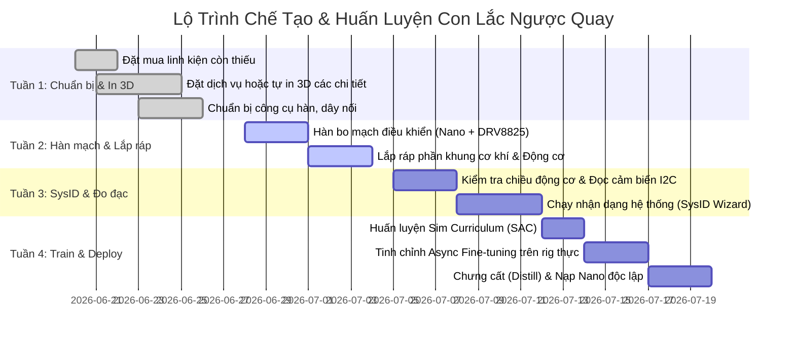

# Kế Hoạch Tiến Độ Dự Án Con Lắc Ngược Quay (Rotary Inverted Pendulum)

*Ngày lập kế hoạch: 20/06/2026*  
*Trạng thái hiện tại:*
*   **Phần mềm**: Đã cấu hình và cài đặt hoàn tất môi trường Python 3.12 (MuJoCo, Stable Baselines 3, PyTorch CUDA GPU) và các thư viện cho Arduino CLI.
*   **Linh kiện đã có**: Tụ sứ 104, tụ hóa 22µF, đồng xu 2-pence (làm tạ đầu mút), công tắc bập bênh Kd105, Arduino Nano, Adapter nguồn 12V 2A, Jack nguồn DC, Rào cắm cái (Female header pins).
*   **Linh kiện đang chờ hoặc chưa đặt**: Động cơ bước NEMA17, Driver DRV8825, Cảm biến AS5600, Phíp lỗ hàn PCB, Vòng bi 608, Tản nhiệt động cơ, các chi tiết in 3D.

---

## 📅 Lộ Trình Tiến Độ Hàng Tuần (4 Tuần)



---

## 🛠️ Chi Tiết Nhiệm Vụ Từng Tuần

### Tuần 1: Chuẩn Bị Linh Kiện & In 3D (20/06 - 27/06) - **[HOÀN THÀNH]**
*   **Mục tiêu**: Hoàn tất việc mua sắm phần cứng, in 3D các chi tiết nhựa để có đầy đủ phôi cơ khí khi các linh kiện điện tử về tới nơi.
*   **Các nhiệm vụ cụ thể**:
    - [x] **Đặt mua ngay các linh kiện còn thiếu**: Động cơ bước NEMA17, Driver DRV8825, Cảm biến AS5600 kèm nam châm, Vòng bi 608, Phíp lỗ FR4, nhôm tản nhiệt (đã đầy đủ linh kiện).
    - [x] **In 3D các bộ phận nhựa**: Cánh tay (Arm), liên kết con lắc (Pendulum link), đế (Base), nắp (Lid) và khớp nối cảm biến (đã in xong và vừa khít).
    - [x] **Chuẩn bị công cụ**: Mỏ hàn (đã phục hồi), dây điện Teflon 24AWG, thiếc hàn, bùi nhùi đồng.

---

### Tuần 2: Hàn Mạch Điện Tử & Lắp Ráp Cơ Khí (28/06 - 04/07) - **[ĐANG THỰC HIỆN]**
*   **Mục tiêu**: Hoàn thành phần cứng vật lý của hệ thống, cắt gọn bo mạch PCB lỗ vừa khít hộp đựng.
*   **Các nhiệm vụ cụ thể**:
    1.  **Cắt phíp lỗ & Hàn bo mạch**:
        - [/] **Cắt mạch lỗ PCB**: Vì mạch lỗ PCB thực tế to hơn hộp chứa, hãy dùng thước sắt và dao rọc giấy khía mạnh nhiều lần ở cả 2 mặt dọc theo rãnh giữa các hàng lỗ (khoảng 40x60mm hoặc đo lọt lòng hộp), sau đó đặt mép cắt sát cạnh bàn và bẻ nhẹ để mạch gãy thẳng tắp dọc theo rãnh. Dùng giũa hoặc giấy ráp mài mịn cạnh cắt.
        - [ ] **Hàn rào cắm cái (Female header pins)**: Lên PCB lỗ cho Arduino Nano và Driver DRV8825 để cắm rút linh hoạt, dễ thay thế khi có cháy chập.
        - [ ] **Hàn giắc nguồn DC cái & Công tắc bập bênh**: Nối tiếp công tắc (đã lắp trên thành hộp) trên đường nguồn 12V cấp cho chân VMOT của driver.
        - [ ] **Hàn hai tụ lọc nguồn (tụ hóa 22µF // tụ sứ 104)**: Sát chân VMOT-GND của Driver để triệt nhiễu đảo chiều động cơ.
        - [ ] **Hàn đường I2C (SDA/SCL)**: Nối từ A4/A5 của Arduino Nano ra rào cắm kết nối cảm biến AS5600.
    2.  **Lắp ráp cơ khí & Xử lý từ tính cảm biến**:
        - [ ] **Lắp động cơ NEMA17**: Lắp động cơ vào đế nhựa và dán tản nhiệt nhôm vào mặt sau.
        - [ ] **Lắp ráp cánh tay và khớp nối**: Ép vòng bi 608 vào khớp nối. Chú ý sử dụng khớp nối nhựa in 3D để giữ khoảng cách cách ly giữa vòng bi sắt từ và nam châm của AS5600 nhằm tránh làm méo đường sức từ.
        - [ ] **Nhét đồng xu đối trọng**: Lắp chặt đồng xu vào đầu thanh lắc.
        - [ ] **Căn chỉnh & Lắp AS5600**:
            * *Xác định cực nam châm:* Nam châm kèm theo AS5600 là loại hướng tâm (diametrically magnetized). Chiều quay tuyệt đối ban đầu không quan trọng (vì cảm biến quay 360 độ tự do), góc lệch offset sẽ được phần mềm tự động hiệu chuẩn.
            * *Khoảng cách cảm biến:* Đảm bảo khoảng cách từ mặt nam châm đến chip AS5600 nằm trong khoảng **1.5 mm - 2.0 mm**.
            * *Chân hướng quay (DIR):* Mặc định nối GND là tăng góc khi quay thuận chiều kim đồng hồ. Nếu sau khi test bị ngược hướng, ta có thể nối chân `DIR` lên VCC hoặc đảo chiều bằng code.

---

### Tuần 3: Kiểm Tra Tín Hiệu & Nhận Dạng Hệ Thống (05/07 - 11/07)
*   **Mục tiêu**: Đảm bảo tất cả phần cứng giao tiếp chính xác và tạo được file cấu hình động lực học thực tế của máy.
*   **Các nhiệm vụ cụ thể**:
    1.  **Kiểm tra chiều & Căn chỉnh**:
        *   Nạp code test I2C để đảm bảo Arduino nhận được cảm biến AS5600 ở địa chỉ `0x36`.
        *   Xác minh chiều quay: Quay cánh tay sang phải (ngược chiều kim đồng hồ nhìn từ trên xuống) thì vị trí động cơ phải tăng. Nghiêng con lắc sang phải thì góc con lắc phải thay đổi đúng chiều.
        *   **Chỉnh Vref**: Dùng đồng hồ vạn năng đo và vặn biến trở trên DRV8825 để đạt mức Vref khoảng **0.485V** (giới hạn dòng điện \(\approx 0.9A\) để motor khỏe mà không quá nóng).
    2.  **Chạy System Identification (SysID)**:
        *   Nạp file `LowLevelServer.ino` lên Arduino Nano.
        *   Kích hoạt môi trường Conda và chạy bộ Wizard nhận dạng hệ thống:
          ```powershell
          conda activate rotary-inverted-pendulum
          cd RotaryInvertedPendulum-python/src/rl
          python sysid_wizard.py
          ```
        *   Wizard sẽ tự chạy cánh tay để đo thời gian tăng tốc động cơ (\(\tau\)) và chu kỳ lắc tự do để cập nhật file `sysid_params.json`.

---

### Tuần 4: Huấn Luyện RL & Triển Khai Chạy Độc Lập (12/07 - 19/07)
*   **Mục tiêu**: Đưa con lắc tự thăng bằng độc lập bằng mạng nơ-ron không cần cắm máy tính.
*   **Các nhiệm vụ cụ thể**:
    1.  **Huấn luyện Curriculum trong mô phỏng**:
        *   Chạy tập lệnh bash để huấn luyện SAC qua 3 giai đoạn có xáo trộn miền (Domain Randomization):
          ```powershell
          bash curriculum_train.sh
          ```
    2.  **Tinh chỉnh trên máy thực (Async Fine-Tuning)**:
        *   Chạy tinh chỉnh 50 tập thực tế để bù đắp sai số cơ khí:
          ```powershell
          python finetune_async.py --policy runs/<sim_run>/last.zip --port <PORT> --episodes 50 --run-name async_v1
          ```
    3.  **Chưng cất & nạp code độc lập**:
        *   Chưng cất mô hình giáo viên đã tinh chỉnh thành mô hình học sinh MLP 5KB:
          ```powershell
          python distill.py --teacher runs/async_v1/last.zip --buffer runs/async_v1/replay_buffer.pkl --out-dir runs/async_v1/distill_student
          ```
        *   Xuất trọng số sang header C++:
          ```powershell
          python export_weights.py --student runs/async_v1/distill_student/student.pt --header ../../../RotaryInvertedPendulum-arduino/RLControl/policy_weights.h --source-name async_v1/distill_student
          ```
        *   Mở Arduino IDE biên dịch và nạp chương trình `RLControl.ino` lên Arduino Nano.
        *   Rút dây cáp USB, cấp nguồn 12V từ adapter và thưởng thức con lắc tự swing-up và thăng bằng hoàn toàn độc lập!
