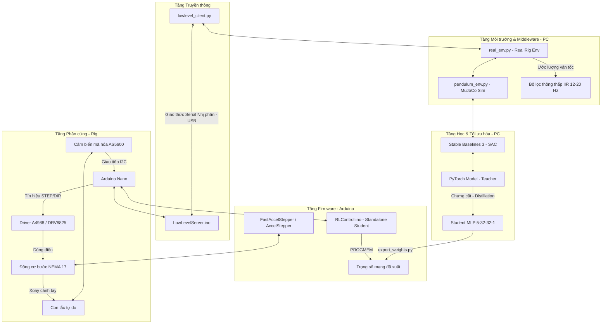
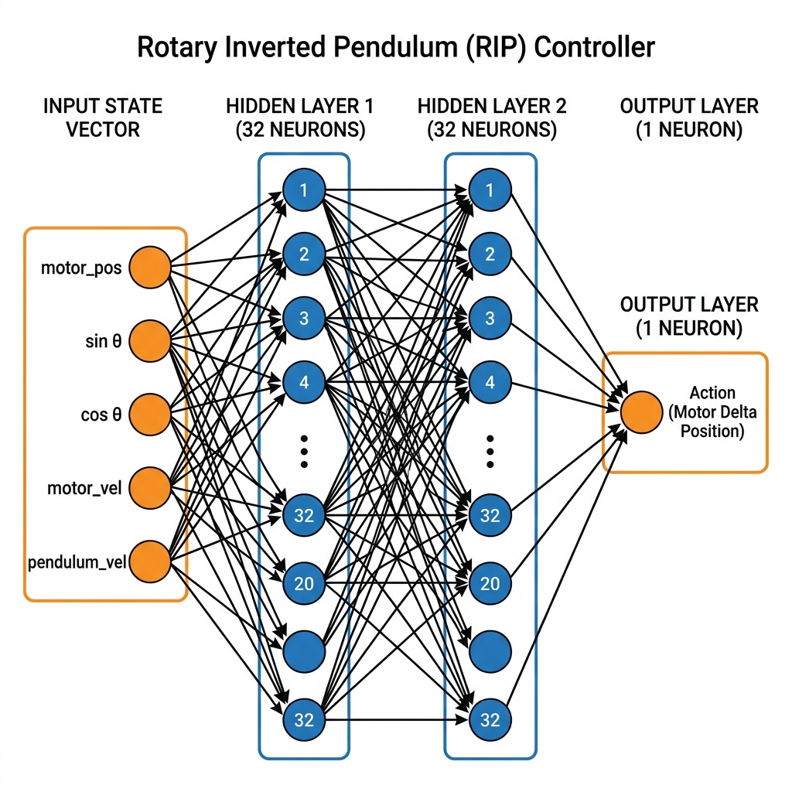
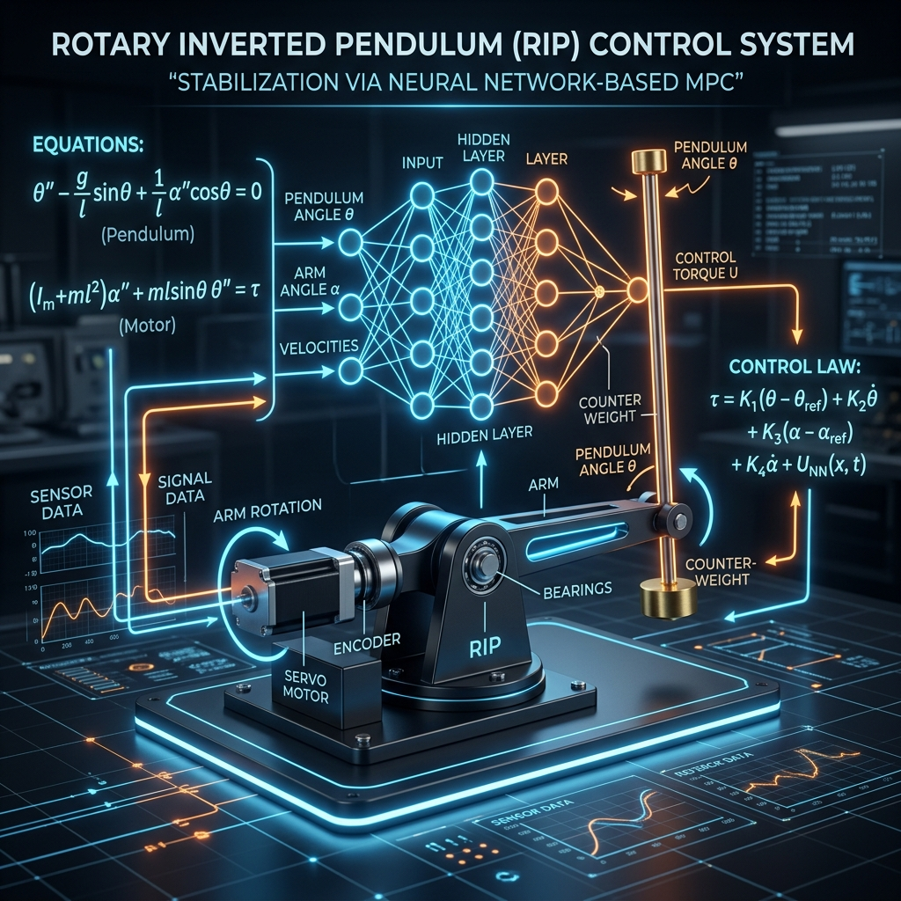

# Con Lắc Ngược Quay (Rotary Inverted Pendulum) - Kiến Trúc Điều Khiển & Quy Trình Sim-to-Real

Tài liệu này cung cấp một cái nhìn tổng quan chi tiết về phương pháp điều khiển, các tầng kiến trúc hệ thống (layers), mô hình mạng nơ-ron hoạt động, và hướng dẫn chi tiết cách huấn luyện lại/tinh chỉnh (train/fine-tune) cho một thiết bị con lắc mới.

---

## 1. Hệ Thống Được Điều Khiển Bằng Gì?

Hệ thống con lắc ngược quay (Furuta Pendulum) trong dự án này sử dụng nhiều phương pháp điều khiển khác nhau tùy thuộc vào cấu hình và mục đích thử nghiệm:

### A. Phương pháp chính: Học tăng cường (Reinforcement Learning - RL)
Đây là nhân tố cốt lõi giúp hệ thống tự học cách đưa con lắc lên (swing-up) và cân bằng (balance) mà không cần lập trình thuật toán điều khiển vật lý thủ công.
* **Thuật toán chính**: **SAC (Soft Actor-Critic)** - một thuật toán RL thuộc lớp Off-Policy, Actor-Critic giúp tối ưu hóa cả phần thưởng (reward) và tính ngẫu nhiên (entropy) của hành động để khám phá không gian trạng thái tốt hơn.
* **Môi trường huấn luyện**: Mô phỏng trong **MuJoCo** (`pendulum_env.py`) với đầy đủ các yếu tố vật lý, ma sát, độ trễ và xáo trộn miền (Domain Randomization).
* **Mô hình Giáo viên (Teacher Policy)**: Là một mạng nơ-ron lớn (~67.000 tham số, kích thước ≈ 270 KB float32) chạy trên máy tính.
* **Mô hình Học sinh (Student Policy)**: Để chạy độc lập trên vi điều khiển **Arduino Nano** (chỉ có 32 KB bộ nhớ flash), mô hình Giáo viên được **chưng cất (distill)** thành một mạng MLP cực nhỏ (kích thước **5 → 32 → 32 → 1**, ≈ 5 KB) và **lượng tử hóa (quantized)** thành các số nguyên/thực tĩnh nằm trong bộ nhớ Flash (`PROGMEM`) của Arduino.

### B. Phương pháp bổ trợ & thử nghiệm
* **PID (Proportional-Integral-Derivative)**: Bộ điều khiển PID tinh chỉnh thủ công (hand-tuned) được cài đặt trực tiếp trong firmware Arduino (`RotaryInvertedPendulum-arduino`) để làm baseline so sánh.
* **LQR (Linear Quadratic Regulator) & MPC (Model Predictive Control)**: Được thử nghiệm và mô phỏng bằng ngôn ngữ **Julia** (`RotaryInvertedPendulum-julia`) kết hợp với công cụ trực quan hóa MeshCat để nghiên cứu lý thuyết điều khiển cổ điển và hiện đại.

---

## 2. Sơ Đồ Các Tầng Hệ Thống (Layers Architecture)

Dưới đây là sơ đồ kiến trúc các tầng từ phần cứng cấp thấp đến thuật toán điều khiển cấp cao:



---

## 3. Quy Trình Huấn Luyện Sim-to-Real

Quy trình dịch chuyển chính sách từ mô phỏng lý thuyết sang thiết bị thực tế trải qua các bước nghiêm ngặt để đảm bảo con lắc không bị mất ổn định do khoảng cách thực tế (Sim-to-Real gap):

```mermaid
flowchart TD
    %% Các bước quy trình
    Step0[<b>Bước 0: Nhận dạng hệ thống (SysID)</b><br/>Đo đạc hằng số thời gian động cơ tau, ma sát và chu kỳ dao động tự do.<br/><i>Đầu ra: sysid_params.json</i>]
    
    Step1[<b>Bước 1: Huấn luyện Curriculum trong Mô phỏng (Sim-to-Sim)</b><br/>Huấn luyện SAC Teacher qua 3 giai đoạn tăng dần độ trễ vật lý và xáo trộn miền (Domain Randomization).<br/><i>Đầu ra: Teacher Model (best_model.zip)</i>]
    
    Step2[<b>Bước 2: Tinh chỉnh Bất đồng bộ trên Thiết bị Thực (Fine-tuning)</b><br/>Chạy song song luồng điều khiển Rig (100 Hz/35 Hz) và luồng huấn luyện SAC gradient để thu hẹp khoảng cách Sim-to-Real.<br/><i>Đầu ra: Tinh chỉnh Teacher + Replay Buffer thực tế</i>]
    
    Step3[<b>Bước 3: Kiểm tra Giáo viên (Tethered Test)</b><br/>Đánh giá trực tiếp Teacher trên thiết bị qua dây USB.<br/><i>Yêu cầu: Điểm upright proxy ≥ 0.90</i>]
    
    Step4[<b>Bước 4: Chưng cất Mô hình (Distillation)</b><br/>Nén Teacher (270 KB) thành Student MLP (5 KB) thông qua hồi quy có giám sát kết hợp tăng cường dữ liệu.<br/><i>Đầu ra: student.pt</i>]
    
    Step5[<b>Bước 5: Kiểm tra Học sinh qua kết nối USB (Tethered)</b><br/>Xác nhận mạng nhỏ tái hiện chính xác hành vi của mạng lớn.<br/><i>Yêu cầu: Điểm upright proxy chênh lệch ≤ 0.05</i>]
    
    Step6[<b>Bước 6: Biên dịch & Nạp Board Độc lập (Standalone Deployment)</b><br/>Xuất trọng số sang header C++, nạp RLControl.ino lên Arduino Nano.<br/><i>Đầu ra: Con lắc tự cân bằng không cần PC</i>]

    %% Hướng đi của quy trình
    Step0 --> Step1
    Step1 --> Step2
    Step2 --> Step3
    Step3 -->|Đạt yêu cầu| Step4
    Step3 -->|Thất bại: upright < 0.85| Step2
    Step4 --> Step5
    Step5 -->|Đạt yêu cầu| Step6
```

### Chi tiết các giai đoạn Curriculum Training (Sim-to-Sim):
Huấn luyện trực tiếp với cấu hình khó ngay từ đầu khiến SAC rất khó hội tụ. Dự án chia làm 3 giai đoạn tăng dần độ trễ truyền thông và xáo trộn hằng số thời gian động cơ \(\tau\):

| Giai đoạn | Độ trễ động cơ \(\tau\) | Độ trễ truyền thông (steps) | Số bước huấn luyện |
| :--- | :--- | :--- | :--- |
| **Giai đoạn 1 (Dễ)** | 0 – 5 ms | 0 – 2 steps | 100,000 |
| **Giai đoạn 2 (Vừa)** | 0 – 10 ms | 2 – 5 steps | 100,000 |
| **Giai đoạn 3 (Khó)** | 0 – 10 ms | 4 – 7 steps | 100,000 |

---

## 4. Mô Phỏng Tầng Hoạt Động Của Mạng (Neural Network Layers Model)

Khác với mạng CNN (Convolutional Neural Network) chuyên xử lý dữ liệu không gian dạng lưới lớn (hình ảnh) thông qua các lớp trích xuất đặc trưng (Convolution, Pooling) rồi mới làm phẳng (Flatten) để đưa vào các lớp kết nối đầy đủ (Fully Connected Layers); mạng điều khiển của con lắc ngược quay (MLP Policy) xử lý trực tiếp một **vectơ trạng thái đặc trưng kích thước nhỏ (5 chiều)**.

Sơ đồ dưới đây minh họa các tầng hoạt động của mạng điều khiển:



### Cơ chế hoạt động của các tầng mạng:
1. **Input Layer (5 đầu vào)**: Nhận trạng thái hiện tại của hệ thống dưới dạng vectơ thực:
   $$s = [x_{\text{motor}}, \sin(\theta), \cos(\theta), v_{\text{motor}}, v_{\text{pendulum}}]$$
   * Việc sử dụng bộ đôi \(\sin(\theta), \cos(\theta)\) thay vì góc lệch tuyệt đối \(\theta\) giúp loại bỏ điểm gián đoạn tuần hoàn tại biên \(\pm\pi\), giúp mạng học mượt mà hơn.
2. **Hidden Layers (Lớp ẩn kết nối đầy đủ)**:
   * **Hidden Layer 1**: Gồm 32 nơ-ron kết nối đầy đủ (Fully Connected) kèm hàm kích hoạt phi tuyến tính (ví dụ: ReLU hoặc Tanh).
   * **Hidden Layer 2**: Gồm 32 nơ-ron kết nối đầy đủ giúp mô hình hóa các tương tác động lực học phi tuyến phức tạp giữa cánh tay quay và con lắc tự do.
3. **Output Layer (1 đầu ra)**:
   * Xuất ra một giá trị duy nhất trong khoảng \([-1, 1]\) qua hàm kích hoạt Tanh.
   * Hành động này được giải lượng tử hóa thành lượng nhích góc mục tiêu (\Delta\text{ position}):
     $$\text{Target}_{\text{new}} = \text{clip}(\text{Target}_{\text{old}} + a \times \text{max\_action\_delta\_rad}, \pm 125^{\circ})$$
     Cách thiết kế đầu ra dạng delta (nudge) thay vì vị trí tuyệt đối giúp giới hạn tốc độ thay đổi góc (slew rate), bảo vệ phần cứng động cơ bước khỏi bị giật đột ngột.

---

## 5. Hướng Dẫn Khắc Phục Sự Cố & Huấn Luyện Lại (Train/Fine-tune Guide)

Nếu bạn có một bản lắp ráp phần cứng giống hệt (clone) nhưng khi nạp code trực tiếp từ repo lại không hoạt động (con lắc bị rung, mất bước, hoặc rơi tự do không tự cân bằng), nguyên nhân chính thường do **sự sai khác cơ học nhỏ (ma sát vòng bi, độ rơ khớp, công suất động cơ ở Vref khác nhau, hoặc hướng cảm biến/động cơ bị ngược)**.

Dưới đây là quy trình khắc phục sự cố, huấn luyện lại từ đầu (Train from scratch) hoặc Tinh chỉnh (Fine-tune):

### Bước 1: Xác minh phần cứng ban đầu (Cực kỳ quan trọng)
Trước khi chạy bất kỳ thuật toán RL nào, bạn phải đảm bảo hệ tọa độ vật lý hoạt động đúng:
1. **Kiểm tra chiều động cơ & cảm biến**:
   - Quay cánh tay nằm ngang ngược chiều kim đồng hồ (nhìn từ trên xuống): giá trị góc động cơ (`motor_pos`) in ra phải **tăng dần (dương)**. Nếu giảm, hãy đảo ngược dây cuộn động cơ bước hoặc đảo cấu hình hướng trong firmware.
   - Nghiêng con lắc sang phải: giá trị góc con lắc phải thay đổi đúng chiều.
2. **Cân chỉnh điểm 0 (Zero-calibration)**:
   - Khi cấp nguồn hoặc bấm nút Reset Arduino, **bắt buộc** con lắc phải treo thẳng đứng xuống dưới và đứng yên hoàn toàn. Arduino Nano lấy vị trí này làm điểm 0 của encoder góc con lắc (tương ứng với góc \(\pm\pi\) rad).
3. **Kiểm tra dòng điện động cơ (Vref)**:
   - Đo và chỉnh Vref trên driver bước (A4988/DRV8825) về khoảng **0.485V - 0.6V** để động cơ đủ lực kéo mà không bị nóng hoặc mất bước.

### Bước 2: Chạy Nhận dạng hệ thống (System Identification - SysID)
Mỗi thiết bị tự chế có ma sát vòng bi và mô-men quán tính riêng. Bạn cần chạy SysID để cập nhật các tham số vật lý thực tế vào trình mô phỏng:
1. Nạp firmware `LowLevelServer.ino` lên Arduino Nano.
2. Truy cập thư mục Python và khởi chạy Wizard:
   ```bash
   cd RotaryInvertedPendulum-python/src/rl
   python sysid_wizard.py
   ```
3. Bộ Wizard sẽ tự động rung cánh tay và thu thập dữ liệu phản hồi bước (step response) và dao động tự do.
4. Đầu ra của quá trình này sẽ tự động ghi đè và cập nhật tệp [sysid_params.json](file:///e:/AI-Models/QwenPaw/workspaces/default/coding_projects/rotary-inverted-pendulum/RotaryInvertedPendulum-python/src/rl/sysid_params.json).

### Bước 3: Huấn luyện lại trong mô phỏng (Sim-to-Sim Curriculum)
Sau khi có cấu hình vật lý thực tế của thiết bị của bạn trong `sysid_params.json`, ta chạy huấn luyện chính sách Giáo viên mới trong mô phỏng MuJoCo:
1. Khởi chạy chương trình huấn luyện 3 giai đoạn:
   ```bash
   bash curriculum_train.sh
   ```
   *Quá trình này mất khoảng ~25 phút trên CPU máy tính. Kết quả xuất ra tệp `runs/<tên-phiên-chạy>/last.zip`.*

### Bước 4: Tinh chỉnh bất đồng bộ trên thiết bị thực (Fine-tuning)
Để lấp đầy khoảng cách giữa mô phỏng và thực tế (Sim-to-Real gap), chúng ta cần cho mô hình chạy trực tiếp trên thiết bị thực và tự sửa lỗi:
1. Chạy lệnh tinh chỉnh bất đồng bộ:
   ```bash
   python finetune_async.py \
       --policy runs/<thư-mục-chạy-mô-phỏng-mới>/last.zip \
       --port <CỔNG_COM_CỦA_NANO> \
       --episodes 50 \
       --run-name async_rig_v1
   ```
2. **Lưu ý thực tế**: Lắng nghe tiếng động cơ bước. Nếu nghe tiếng kẹt kẹt hoặc rung dữ dội, nghĩa là gia tốc yêu cầu của mạng quá lớn gây mất bước. Hãy giảm `MOTOR_ACCELERATION` trong file `LowLevelServer.ino` và `RLControl.ino` từ 50,000 xuống 30,000 rồi nạp lại.
3. Nếu con lắc đã có xu hướng cân bằng nhưng chưa vững, tiếp tục tinh chỉnh tích lũy từ buffer cũ:
   ```bash
   python finetune_async.py \
       --policy runs/async_rig_v1/last.zip \
       --resume-buffer runs/async_rig_v1/replay_buffer.pkl \
       --port <CỔNG_COM_CỦA_NANO> \
       --episodes 30 \
       --run-name async_rig_v2
   ```

### Bước 5: Chưng cất & nạp code chạy độc lập (Distillation & Deployment)
1. Chưng cất mô hình Giáo viên lớn thành mô hình Học sinh nhỏ 5 KB:
   ```bash
   python distill.py \
       --teacher runs/async_rig_v2/last.zip \
       --buffer runs/async_rig_v2/replay_buffer.pkl \
       --out-dir runs/async_rig_v2/distill_student
   ```
2. Xuất trọng số mạng nơ-ron ra file header của Arduino:
   ```bash
   python export_weights.py \
       --student runs/async_rig_v2/distill_student/student.pt \
       --header ../../../RotaryInvertedPendulum-arduino/RLControl/policy_weights.h \
       --source-name async_rig_v2/distill_student
   ```
3. Nạp code độc lập `RLControl.ino` lên Arduino Nano bằng Arduino IDE hoặc `arduino-cli`. Khi nạp xong, reset Arduino khi con lắc đang treo thẳng đứng xuống dưới và đứng yên để hiệu chuẩn góc.

---

## 6. Minh Họa Hệ Thống Điều Khiển Đồ Họa Cao Cấp

Dưới đây là thiết kế phối cảnh 3D tổng quan về cấu trúc cơ khí và luồng phản hồi vòng kín của hệ thống con lắc ngược quay:


