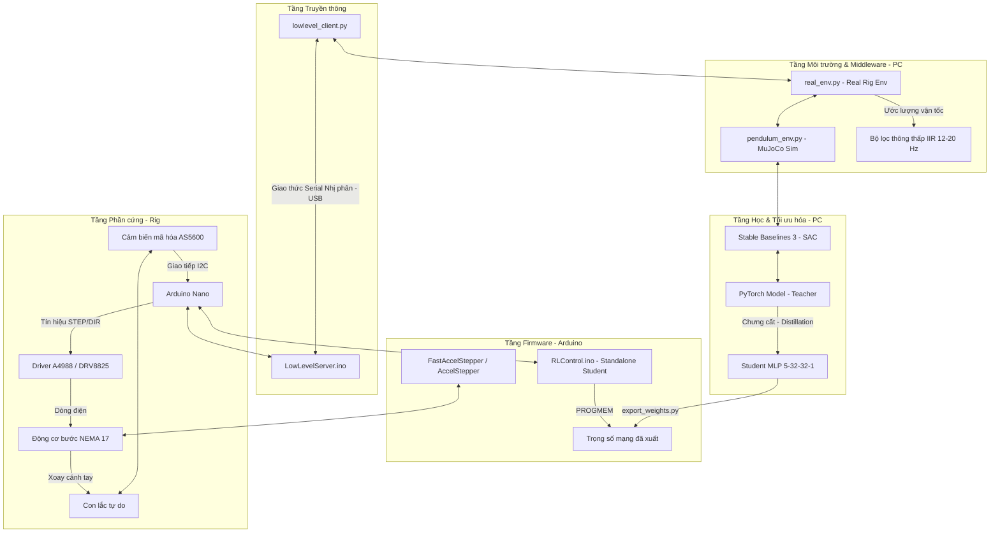

# Con Lắc Ngược Quay (Rotary Inverted Pendulum) - Kiến Trúc Điều Khiển & Quy Trình Sim-to-Real

Tài liệu này cung cấp một cái nhìn tổng quan chi tiết về phương pháp điều khiển, các tầng kiến trúc hệ thống (layers), và quy trình huấn luyện từ mô phỏng sang thực tế (Sim-to-Real pipeline) của dự án.

---

## 1. Hệ Thống Được Điều Khiển Bằng Gì?

Hệ thống con lắc ngược quay (Furuta Pendulum) trong dự án này sử dụng nhiều phương pháp điều khiển khác nhau tùy thuộc vào cấu hình và mục đích thử nghiệm:

### A. Phương pháp chính: Học tăng cường (Reinforcement Learning - RL)
Đây là nhân tố cốt lõi giúp hệ thống tự học cách đưa con lắc lên (swing-up) và cân bằng (balance) mà không cần lập trình thuật toán điều khiển vật lý thủ công.
* **Thuật toán chính**: **SAC (Soft Actor-Critic)** - một thuật toán RL thuộc lớp Off-Policy, Actor-Critic giúp tối ưu hóa cả phần thưởng (reward) và tính ngẫu nhiên (entropy) của hành động để khám phá không gian trạng thái tốt hơn.
* **Môi trường huấn luyện**: Mô phỏng trong **MuJoCo** (`pendulum_env.py`) với đầy đủ các yếu tố vật lý, ma sát, độ trễ và xáo trộn miền (Domain Randomization).
* **Mô hình Giáo viên (Teacher Policy)**: Là một mạng nơ-ron lớn (~67.000 tham số, kích thước ≈ 270 KB float32) chạy trên máy tính.
* **Mô hình Học sinh (Student Policy)**: Để chạy độc lập trên vi điều khiển **Arduino Nano** (chỉ có 32 KB bộ nhớ flash), mô hình Giáo viên được **chưng cất (distill)** thành một mạng MLP cực nhỏ (kích thước **5 → 32 → 32 → 1**, ≈ 5 KB) và **lượng tử hóa (quantized)** thành các số nguyên/thực tĩnh nằm trong bộ nhớ Flash (`PROGMEM`) của Arduino.

### B. Phương pháp bổ trợ & thử nghiệm
* **PID (Proportional-Integral-Derivative)**: Bộ điều khiển PID tinh chỉnh thủ công (hand-tuned) được cài đặt trực tiếp trong firmware Arduino (`RotaryInvertedPendulum-arduino`) để làm baseline so sánh.
* **LQR (Linear Quadratic Regulator) & MPC (Model Predictive Control)**: Được thử nghiệm và mô phỏng bằng ngôn ngữ **Julia** (`RotaryInvertedPendulum-julia`) kết hợp với công cụ trực quan hóa MeshCat để nghiên cứu lý thuyết điều khiển cổ điển và hiện đại.

---

## 2. Sơ Đồ Các Tầng Hệ Thống (Layers Architecture)

Dưới đây là sơ đồ kiến trúc các tầng từ phần cứng cấp thấp đến thuật toán điều khiển cấp cao:



---

## 3. Quy Trình Huấn Luyện Sim-to-Real

Quy trình dịch chuyển chính sách từ mô phỏng lý thuyết sang thiết bị thực tế trải qua các bước nghiêm ngặt để đảm bảo con lắc không bị mất ổn định do khoảng cách thực tế (Sim-to-Real gap):

```mermaid
flowchart TD
    %% Các bước quy trình
    Step0[<b>Bước 0: Nhận dạng hệ thống (SysID)</b><br/>Đo đạc hằng số thời gian động cơ tau, ma sát và chu kỳ dao động tự do.<br/><i>Đầu ra: sysid_params.json</i>]
    
    Step1[<b>Bước 1: Huấn luyện Curriculum trong Mô phỏng (Sim-to-Sim)</b><br/>Huấn luyện SAC Teacher qua 3 giai đoạn tăng dần độ trễ vật lý và xáo trộn miền (Domain Randomization).<br/><i>Đầu ra: Teacher Model (best_model.zip)</i>]
    
    Step2[<b>Bước 2: Tinh chỉnh Bất đồng bộ trên Thiết bị Thực (Fine-tuning)</b><br/>Chạy song song luồng điều khiển Rig (100 Hz/35 Hz) và luồng huấn luyện SAC gradient để thu hẹp khoảng cách Sim-to-Real.<br/><i>Đầu ra: Tinh chỉnh Teacher + Replay Buffer thực tế</i>]
    
    Step3[<b>Bước 3: Kiểm tra Giáo viên (Tethered Test)</b><br/>Đánh giá trực tiếp Teacher trên thiết bị qua dây USB.<br/><i>Yêu cầu: Điểm upright proxy ≥ 0.90</i>]
    
    Step4[<b>Bước 4: Chưng cất Mô hình (Distillation)</b><br/>Nén Teacher (270 KB) thành Student MLP (5 KB) thông qua hồi quy có giám sát kết hợp tăng cường dữ liệu.<br/><i>Đầu ra: student.pt</i>]
    
    Step5[<b>Bước 5: Kiểm tra Học sinh qua kết nối USB (Tethered)</b><br/>Xác nhận mạng nhỏ tái hiện chính xác hành vi của mạng lớn.<br/><i>Yêu cầu: Điểm upright proxy chênh lệch ≤ 0.05</i>]
    
    Step6[<b>Bước 6: Biên dịch & Nạp Board Độc lập (Standalone Deployment)</b><br/>Xuất trọng số sang header C++, nạp RLControl.ino lên Arduino Nano.<br/><i>Đầu ra: Con lắc tự cân bằng không cần PC</i>]

    %% Hướng đi của quy trình
    Step0 --> Step1
    Step1 --> Step2
    Step2 --> Step3
    Step3 -->|Đạt yêu cầu| Step4
    Step3 -->|Thất bại: upright < 0.85| Step2
    Step4 --> Step5
    Step5 -->|Đạt yêu cầu| Step6
```

### Chi tiết các giai đoạn Curriculum Training (Sim-to-Sim):
Huấn luyện trực tiếp với cấu hình khó ngay từ đầu khiến SAC rất khó hội tụ. Dự án chia làm 3 giai đoạn tăng dần độ trễ truyền thông và xáo trộn hằng số thời gian động cơ \(\tau\):

| Giai đoạn | Độ trễ động cơ \(\tau\) | Độ trễ truyền thông (steps) | Số bước huấn luyện |
| :--- | :--- | :--- | :--- |
| **Giai đoạn 1 (Dễ)** | 0 – 5 ms | 0 – 2 steps | 100,000 |
| **Giai đoạn 2 (Vừa)** | 0 – 10 ms | 2 – 5 steps | 100,000 |
| **Giai đoạn 3 (Khó)** | 0 – 10 ms | 4 – 7 steps | 100,000 |

---

## 4. Minh Họa Hệ Thống Điều Khiển

Dưới đây là hình ảnh minh họa đồ họa cao cấp của hệ thống con lắc ngược quay tích hợp mạng nơ-ron điều khiển:


